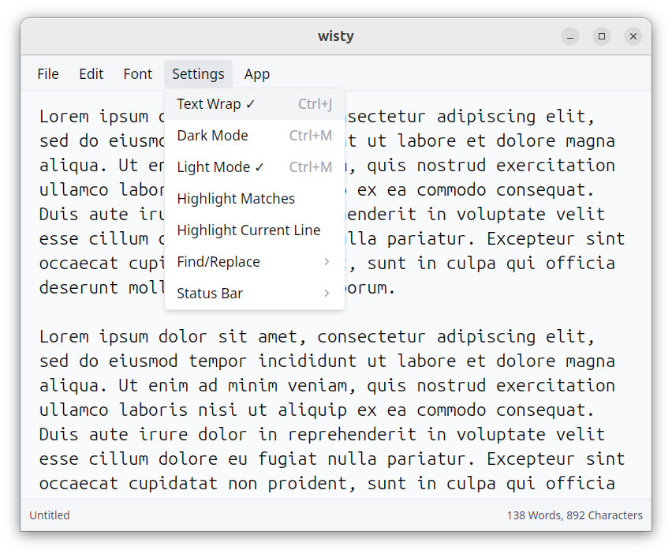
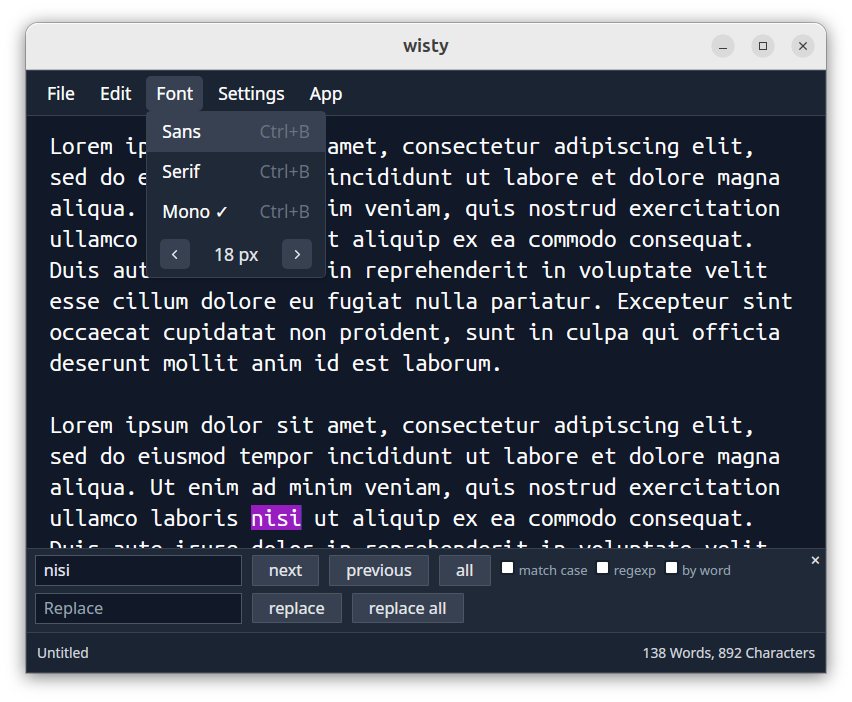

# Wisty

Wisty is a lightweight text editor for Linux with a clean, elegant look. It is intended for general use (don't expect code highlighting). It only handles UTF-8 files and has support for very large files (streamed read/write, will attempt to open files up to 1GB).

Wisty was originally a fork of [Parchment](https://github.com/tywil04/parchment) but has been completely rewritten in Typescript. (Disclaimer: wisty was vibecoded, but with an emphasis good coding practices).




The main motivation for creating wisty was aesthetics. I wasn't happy with the visual style of any existing Linux graphical text editors. Gnome Text Editor looks reasonable but I don't like the unconventional menu layout and the cluttered look of the title bar. Also, I wanted a genuinely lightweight editor. I think there is room for at least one text editor which doesn't have extensive code parsing and highlighting features. Even if these features don't use a lot of resources, they still clutter the app and spoil the minimalist vibe which I like. I just want somewhere basic where I can quickly view text or temporarily paste things, which also looks really nice.

## Installation

The simplest approach (IMHO) is a user-only install (sudo not required, installs in your home dir). 

### Install from user tarball

1. Download the latest `wisty-user-install-<version>-linux-<arch>.tar.gz` from Releases.
2. Extract it:

```bash
tar -xzf wisty-user-install-*.tar.gz
cd wisty-user-install-*
```

3. Run the installer:

```bash
./install.sh
```

The installer will:

- install the binary to `~/.local/bin/wisty`
- install the desktop entry to `~/.local/share/applications/wisty.desktop`
- install icons to:
  - `~/.local/share/icons/hicolor/32x32/apps/wisty.png`
  - `~/.local/share/icons/hicolor/64x64/apps/wisty.png`
  - `~/.local/share/icons/hicolor/128x128/apps/wisty.png`
  - `~/.local/share/icons/hicolor/256x256/apps/wisty.png`

If `~/.local/bin` is not already on your `PATH`, the installer will prompt you and offer to add it so `wisty` can be run from the command line.

To uninstall, run `./uninstall.sh` from the extracted archive. It removes the files above and can also remove the PATH block (with confirmation).

### Other package formats

You can also download packaged builds from Releases:

- `.deb`
- `.rpm`
- `.AppImage`

## Linux runtime libraries

wisty requires **WebKitGTK 4.1** at runtime (`libwebkit2gtk-4.1`).

It also requires GTK runtime libraries (GTK 3) and related system components used by Tauri/WebKitGTK.

You may already have these, if not, install them like this:

### Ubuntu / Debian

```bash
sudo apt install -y libwebkit2gtk-4.1-0 libgtk-3-0 libayatana-appindicator3-1
```

### Fedora

```bash
sudo dnf install -y webkit2gtk4.1 gtk3 libappindicator-gtk3
```

### Arch Linux

```bash
sudo pacman -S --needed webkit2gtk-4.1 gtk3 libappindicator-gtk3
```

## Build prerequisites (from source)

If you are building wisty from source, you will also need development packages.

### Ubuntu / Debian

```bash
sudo apt install -y build-essential pkg-config libssl-dev libgtk-3-dev libwebkit2gtk-4.1-dev libayatana-appindicator3-dev librsvg2-dev
```

### Fedora

```bash
sudo dnf install -y gcc gcc-c++ make pkgconf-pkg-config openssl-devel gtk3-devel webkit2gtk4.1-devel libappindicator-gtk3-devel librsvg2-devel
```

### Arch Linux

```bash
sudo pacman -S --needed base-devel pkgconf openssl gtk3 webkit2gtk-4.1 libappindicator-gtk3 librsvg
```

## Build and run

From the project root:

```bash
npm run tauri -- dev
```

Build Linux release artifacts:

```bash
npm run tauri -- build
```

## Open source libraries used

Many thanks to the developers of these libraries which are used in this project.

### App framework and runtime

- [Tauri](https://github.com/tauri-apps/tauri)
- [WebKitGTK](https://webkitgtk.org/)
- [GTK](https://www.gtk.org/)

### Tauri plugins

- [plugin-dialog](https://github.com/tauri-apps/plugins-workspace/tree/v2/plugins/dialog)
- [plugin-fs](https://github.com/tauri-apps/plugins-workspace/tree/v2/plugins/fs)
- [plugin-shell](https://github.com/tauri-apps/plugins-workspace/tree/v2/plugins/shell)
- [plugin-store](https://github.com/tauri-apps/plugins-workspace/tree/v2/plugins/store)
- [plugin-os](https://github.com/tauri-apps/plugins-workspace/tree/v2/plugins/os)
- [plugin-log](https://github.com/tauri-apps/plugins-workspace/tree/v2/plugins/log)
- [plugin-clipboard-manager](https://github.com/tauri-apps/plugins-workspace/tree/v2/plugins/clipboard-manager)

### Frontend and editor

- [SolidJS](https://github.com/solidjs/solid)
- [CodeMirror 6](https://github.com/codemirror/dev)

### Tooling

- [Vite](https://github.com/vitejs/vite)
- [vite-plugin-solid](https://github.com/solidjs/vite-plugin-solid)
- [Tailwind CSS](https://github.com/tailwindlabs/tailwindcss)
- [PostCSS](https://github.com/postcss/postcss)
- [Autoprefixer](https://github.com/postcss/autoprefixer)

## Credits

- Original project: [Parchment](https://github.com/tywil04/parchment)
